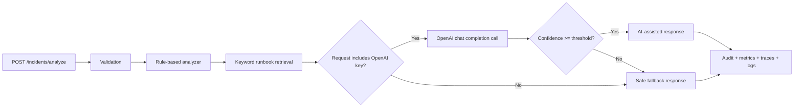

# Incident Copilot API

AI-assisted incident triage service built with Spring Boot. It uses LLMs for summarization and next-step suggestions, with rule-based checks, fallbacks, observability, and CI to keep the system production-minded. The beginner path is intentionally plug-and-play: run the app locally, call one endpoint, and optionally bring your own OpenAI key per request.

## Problem statement

During an incident, engineers need a fast first draft of what is happening without blindly trusting a model. This service accepts a structured incident payload and returns:

- a short summary
- likely root-cause candidates
- suggested debugging steps
- a confidence score
- a safe fallback response when AI is unavailable or low-confidence

The project is intentionally opinionated: AI is helpful for synthesis, but guardrails, validation, and fallback behavior are responsible for reliability.

## Why AI is used

- To compress noisy logs and deployment context into a short triage summary
- To suggest plausible next debugging steps from the available evidence
- To incorporate relevant runbook snippets into the first draft

## Where AI is not trusted

- Rule-based checks run first for obvious known failures
- AI output must be structurally valid and meet a confidence threshold
- If the caller does not provide an OpenAI key, AI is unavailable, the model times out, or the response is weak, the API returns a rule-based fallback
- Audit metadata captures prompt version, latency, fallback reason, and retrieved runbooks

## Architecture



## API

### `POST /incidents/analyze`

Optional request headers:

- `X-OpenAI-API-Key`: caller-supplied OpenAI API key for this one request
- `X-OpenAI-Model`: optional override, defaults to `gpt-4o-mini`

Why headers instead of putting the key in JSON:

- easier to reuse with curl/Postman
- avoids mixing secrets into request payloads or saved sample bodies
- keeps the server stateless with respect to model credentials

Sample request:

```json
{
  "serviceName": "payment-service",
  "errorLog": "org.postgresql.util.PSQLException: Connection refused\ncom.zaxxer.hikari.pool.HikariPool$PoolInitializationException: Failed to initialize pool",
  "environment": "production",
  "recentDeploy": true,
  "previousIncidentNotes": "The last outage involved rotated database credentials after a deploy."
}
```

Sample response:

```json
{
  "summary": "Database connectivity or pool exhaustion appears in the error details. Rule-based fallback is being returned to keep the response safe.",
  "possibleCauses": [
    "The service cannot reach the database or is exhausting its connection pool.",
    "Database credentials, network policy, or pool sizing may be incorrect."
  ],
  "suggestedChecks": [
    "Verify database health, credentials, and recent secret rotations.",
    "Inspect connection pool saturation and active connection counts.",
    "Review guidance in runbook database-connection-runbook.md."
  ],
  "confidenceScore": 0.83,
  "analysisMode": "RULE_BASED_FALLBACK",
  "safeFallbackApplied": true,
  "audit": {
    "latencyMs": 21,
    "promptVersion": "v1",
    "aiAttempted": false,
    "fallbackReason": "REQUEST_API_KEY_MISSING",
    "matchedRules": ["recent-deploy", "database-connectivity"],
    "retrievedRunbooks": ["database-connection-runbook.md"]
  }
}
```

## Repo structure

```text
incident-copilot-api/
  src/main/java/...
  src/test/java/...
  docs/runbooks/
  sample-data/incidents/
  .github/workflows/ci.yml
  Dockerfile
  README.md
```

## Local run

Requirements:

- Java 21

Run in fallback-only mode:

```bash
./mvnw spring-boot:run
```

Plug-and-play AI mode with a caller-provided key:

```bash
curl -X POST http://localhost:8080/incidents/analyze \
  -H "Content-Type: application/json" \
  -H "X-OpenAI-API-Key: YOUR_OPENAI_KEY" \
  -H "X-OpenAI-Model: gpt-4o-mini" \
  -d @sample-data/incidents/payment-db-timeout.json
```

Run tests:

```bash
./mvnw test
```

## Configuration

Key environment variables:

- `INCIDENT_AI_ENABLED`: set to `false` to force rule-based fallback for every request.
- `OPENAI_BASE_URL`: defaults to `https://api.openai.com`.
- `OPENAI_MODEL`: default model when the caller does not send `X-OpenAI-Model`.
- `OTEL_EXPORTER_OTLP_ENDPOINT`: optional OTLP endpoint for trace export.

There is no required server-side OpenAI secret anymore. If a request omits `X-OpenAI-API-Key`, the app safely falls back to rule-based analysis.

## Observability

- `@Observed` instrumentation on the analysis flow for trace spans
- Micrometer timer and request counters tagged by analysis mode and fallback reason
- Actuator endpoints for health and metrics
- Log correlation fields for trace and span IDs

Suggested screenshots for the portfolio README:

- trace timeline for one analysis request
- metrics chart for AI-assisted vs fallback responses
- logs showing correlation IDs and fallback reasons

## Testing

The test suite covers:

- happy path AI-assisted analysis
- safe fallback when the request omits an API key
- safe fallback when AI is disabled
- safe fallback when AI returns low-confidence output
- Spring Boot context startup

## Tradeoffs

- The runbook retrieval is intentionally simple keyword matching for v1, not a full vector database
- Confidence is model-provided plus threshold-gated, not calibrated against historical outcomes
- The AI client currently targets the OpenAI Chat Completions API with a request-scoped key to keep the setup minimal for beginners

## Future improvements

- Add embeddings-backed retrieval for larger runbook collections
- Persist incident analyses and feedback for offline evaluation
- Add request authentication and rate limiting
- Stream analysis status to clients for slower models
- Add dashboards and collector config for end-to-end OpenTelemetry demos

## Suggested repo description

AI-assisted incident triage service built with Spring Boot. Uses LLMs for summarization and next-step suggestions, with rule-based checks, fallbacks, observability, and CI to keep the system production-minded.
