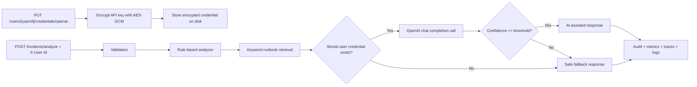

# Incident Copilot API

AI-assisted incident triage service built with Spring Boot. It uses LLMs for summarization and next-step suggestions, with rule-based checks, fallbacks, observability, and CI to keep the system production-minded. The onboarding path is now plug-and-play but safer: a user saves an OpenAI key once, the backend stores it encrypted, and later analysis calls use only a user ID.

## Problem statement

During an incident, engineers need a fast first draft of what is happening without blindly trusting a model. This service accepts a structured incident payload and returns:

- a short summary
- likely root-cause candidates
- suggested debugging steps
- a confidence score
- a safe fallback response when AI is unavailable or low-confidence

The project is intentionally opinionated: AI is helpful for synthesis, but guardrails, validation, and fallback behavior are responsible for reliability.

## Why AI is used

- To compress noisy logs and deployment context into a short triage summary
- To suggest plausible next debugging steps from the available evidence
- To incorporate relevant runbook snippets into the first draft

## Where AI is not trusted

- Rule-based checks run first for obvious known failures
- AI output must be structurally valid and meet a confidence threshold
- If a user has not connected an OpenAI key, AI is disabled, the model times out, or the response is weak, the API returns a rule-based fallback
- Audit metadata captures prompt version, latency, fallback reason, and retrieved runbooks

## Architecture



## API

### `PUT /users/{userId}/credentials/openai`

Stores a user’s OpenAI key encrypted on the backend. The raw key is sent once over HTTPS and is not returned by the API.

Sample request:

```json
{
  "apiKey": "sk-your-openai-key",
  "defaultModel": "gpt-4o-mini"
}
```

Sample response:

```json
{
  "userId": "demo-user",
  "provider": "openai",
  "credentialStored": true,
  "defaultModel": "gpt-4o-mini",
  "updatedAt": "2026-03-30T20:00:00Z"
}
```

### `GET /users/{userId}/credentials/openai`

Returns whether a stored credential exists for the user. It never returns the raw API key.

### `DELETE /users/{userId}/credentials/openai`

Deletes the stored encrypted credential for the user.

### `POST /incidents/analyze`

Required header for stored-BYOK mode:

- `X-User-Id`: user identity used to look up the encrypted stored credential

If the user has no stored credential, the service returns a safe rule-based fallback instead of failing hard.

Sample request:

```json
{
  "serviceName": "payment-service",
  "errorLog": "org.postgresql.util.PSQLException: Connection refused\ncom.zaxxer.hikari.pool.HikariPool$PoolInitializationException: Failed to initialize pool",
  "environment": "production",
  "recentDeploy": true,
  "previousIncidentNotes": "The last outage involved rotated database credentials after a deploy."
}
```

Sample response:

```json
{
  "summary": "Database connectivity or pool exhaustion appears in the error details. Rule-based fallback is being returned to keep the response safe.",
  "possibleCauses": [
    "The service cannot reach the database or is exhausting its connection pool.",
    "Database credentials, network policy, or pool sizing may be incorrect."
  ],
  "suggestedChecks": [
    "Verify database health, credentials, and recent secret rotations.",
    "Inspect connection pool saturation and active connection counts.",
    "Review guidance in runbook database-connection-runbook.md."
  ],
  "confidenceScore": 0.83,
  "analysisMode": "RULE_BASED_FALLBACK",
  "safeFallbackApplied": true,
  "audit": {
    "latencyMs": 21,
    "promptVersion": "v1",
    "aiAttempted": false,
    "fallbackReason": "USER_API_KEY_MISSING",
    "matchedRules": ["recent-deploy", "database-connectivity"],
    "retrievedRunbooks": ["database-connection-runbook.md"]
  }
}
```

## Repo structure

```text
incident-copilot-api/
  src/main/java/...
  src/test/java/...
  docs/runbooks/
  sample-data/incidents/
  .github/workflows/ci.yml
  Dockerfile
  README.md
```

## Local run

Requirements:

- Java 21

Run locally:

```bash
./mvnw spring-boot:run
```

Save a user key once:

```bash
curl -X PUT http://localhost:8080/users/demo-user/credentials/openai \
  -H "Content-Type: application/json" \
  -d '{
    "apiKey": "YOUR_OPENAI_KEY",
    "defaultModel": "gpt-4o-mini"
  }'
```

Analyze using only the user ID:

```bash
curl -X POST http://localhost:8080/incidents/analyze \
  -H "Content-Type: application/json" \
  -H "X-User-Id: demo-user" \
  -d @sample-data/incidents/payment-db-timeout.json
```

Run tests:

```bash
./mvnw test
```

## Configuration

Key environment variables:

- `INCIDENT_AI_ENABLED`: set to `false` to force rule-based fallback for every request.
- `OPENAI_BASE_URL`: defaults to `https://api.openai.com`.
- `OPENAI_MODEL`: default model stored for users when one is not supplied at save time.
- `INCIDENT_CREDENTIAL_STORE_DIRECTORY`: where encrypted per-user credentials are stored.
- `INCIDENT_MASTER_KEY_PATH`: where the AES master key is stored.
- `OTEL_EXPORTER_OTLP_ENDPOINT`: optional OTLP endpoint for trace export.

There is no shared server-side OpenAI API key anymore. The service encrypts user-supplied keys at rest with AES-GCM and stores them locally by default.

For beginners:

- first run creates a local master key under `data/security/master.key`
- encrypted credentials are stored under `data/credentials`
- `.gitignore` excludes those runtime files

For deployed environments:

- mount persistent storage for the credential directory and master key path
- treat the master key like any other application secret
- rotate or move the master key to KMS/Vault later if you need a stronger security posture

## Observability

- `@Observed` instrumentation on the analysis flow for trace spans
- Micrometer timer and request counters tagged by analysis mode and fallback reason
- Actuator endpoints for health and metrics
- Log correlation fields for trace and span IDs

Suggested screenshots for the portfolio README:

- trace timeline for one analysis request
- metrics chart for AI-assisted vs fallback responses
- logs showing correlation IDs and fallback reasons

## Testing

The test suite covers:

- happy path AI-assisted analysis
- save/get/delete encrypted user credential flow
- safe fallback when the user has no stored key
- safe fallback when AI is disabled
- safe fallback when AI returns low-confidence output
- Spring Boot context startup

## Tradeoffs

- The runbook retrieval is intentionally simple keyword matching for v1, not a full vector database
- Confidence is model-provided plus threshold-gated, not calibrated against historical outcomes
- The credential store is local filesystem-backed to keep setup beginner-friendly; a database or secret manager would be a better fit for multi-instance deployments

## Future improvements

- Add embeddings-backed retrieval for larger runbook collections
- Persist incident analyses and feedback for offline evaluation
- Add request authentication and rate limiting
- Stream analysis status to clients for slower models
- Add dashboards and collector config for end-to-end OpenTelemetry demos

## Suggested repo description

AI-assisted incident triage service built with Spring Boot. Uses LLMs for summarization and next-step suggestions, with rule-based checks, fallbacks, observability, and CI to keep the system production-minded.
